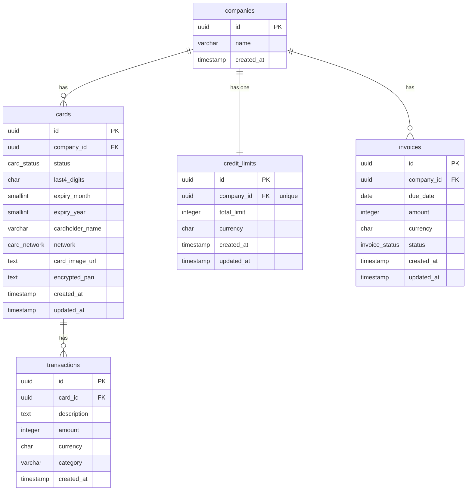

# Qred Case Study

A full-stack company dashboard for Qred's credit card product.

---

## 📋 Contents

- [🧭 Overview](#-overview)
  - [Deliverables](#deliverables)
  - [Timeline](#timeline)
  - [Tools & references](#tools--references)
  - [Approach & shortcuts](#approach--shortcuts)
  - [Given more time...!](#given-more-time-the-following-would-be-the-natural-next-steps)
- [🚀 Getting started locally](#-getting-started-locally)
  - [Option A — Full Docker](#option-a--full-docker-recommended)
  - [Option B — Native dev](#option-b--native-dev-postgres-via-docker-only)
- [⚙️ Architecture](#️-architecture)
  - [AWS](#aws)
  - [Backend](#backend)
  - [Frontend](#frontend)
- [🗄️ Database](#️-database)
  - [Schema](#schema)
  - [Local setup](#local-setup)
  - [Migrations](#migrations)
  - [Seed data](#seed-data)
- [📡 API endpoints](#-api-endpoints)
- [🔐 Auth](#-auth)
- [🚀 Local auth setup](#-local-auth-setup)
- [🧪 Tests](#-tests)

---

## 🧭 Overview

### Deliverables

| Task | Description | Link |
|------|-------------|------|
| Task 1 — Strategy & Collaboration Proposal | Short presentation on improving frontend/backend collaboration, API planning, and PM alignment | [View presentation](https://main.d8bbch8q6eqth.amplifyapp.com/presentation) |
| Task 2 — Full-stack implementation | Company dashboard with real backend, database, AWS deployment, and tests | [Live demo](https://main.d8bbch8q6eqth.amplifyapp.com/) |

---

### Timeline

| Phase | Activities | Duration |
|-------|-----------|----------|
| Phase 0 — AWS exploration (Friday) | Hands-on AWS ramp-up: provisioning RDS instances, deploying Lambda functions via CLI, configuring API Gateway routes, setting up SSM Parameter Store secrets, and understanding VPC networking constraints | ~ 3/4 day |
| Phase 1 — Planning & scaffolding | Architecture design, data contract definition, commit choreography plan in markdown; monorepo boilerplate setup with Yarn workspaces, shared types package, Drizzle schema, and Docker local environment | ~ 3.0 h |
| Phase 2 — Implementation, testing & deploy | around 12 PRs — auth middleware → UI with dummy data → database migrations & seed → full-stack feature slices (dashboard, transactions, invoice, cards) → unit & integration tests → Docker setup & Amplify deployment | ~ 7–8.5 h |
| **Total** | | **~10–11.5 h** |

---

### Tools & references

- [Claude Code](https://claude.ai/code) — primary development assistant throughout the project, including a detailed architecture and commit choreography plan prepared ahead of implementation
- [Next.js documentation](https://nextjs.org/docs) — App Router, parallel routes, server actions, and Amplify deployment
- [AWS documentation](https://docs.aws.amazon.com) — Lambda, API Gateway, RDS, Amplify, SSM Parameter Store
- Personal monorepo templates — prior Yarn workspace scaffolds used as structural references

---

### Approach & shortcuts

The project started with an exploration phase on a personal AWS account — working through Lambda, API Gateway, RDS, Amplify, and ECS hands-on to understand how the pieces fit together before writing a line of application code. While doing this, a detailed architecture plan and commit choreography were sketched out in markdown, then used as a guide throughout implementation.

Once the plan was solid, existing monorepo scaffolds were used as structural references to bootstrap the Yarn workspace quickly and keep focus on the application logic rather than config.

**Auth shortcut:** the Lambda endpoints use JWT verification, but the token is pre-generated via a script rather than issued through a proper login flow. This was a deliberate trade-off to stay focused on the core dashboard functionality within the available time. Given more time, a full JWT auth flow — token issuance, refresh, and expiry handling — would be the natural next step.

**Seed data shortcut:** the database is populated via a manual seed script rather than through real user onboarding or an admin flow. Fixed UUIDs are used to keep the seed idempotent and to match the dev JWT token's `companyId`, allowing immediate API testing after setup. In production, data would be created through proper registration and onboarding flows.

**Given more time, the following would be the natural next steps:**

- **Full JWT auth flow** — proper login endpoint with token issuance, refresh tokens, and expiry handling rather than a pre-generated static token
- **User registration & onboarding** — replace the seed script with real company and user creation flows
- **End-to-end tests** — Playwright test suite covering the full dashboard flow: login → view card → activate → view transactions → pay invoice
- **Error boundaries & loading states** — proper `error.tsx` and `loading.tsx` pages across all routes for a production-ready UX
- **Card payment flow** — full invoice payment UI wired to a payment provider rather than the current status-only display
- **CI/CD pipeline** — GitHub Actions workflow running lint, type-check, and the full test suite on every PR before merge

---

## 🚀 Getting started locally

**Prerequisites:** Node 24, Docker, Yarn (via Corepack)

```bash
corepack enable
yarn install
cp .env.example .env
```

Edit `.env` — set `JWT_SECRET` to a long random string (`openssl rand -hex 32`) and set `NEXT_PUBLIC_API_TOKEN` after the step below.

---

### Option A — Full Docker (recommended)

Runs Postgres, backend, and frontend all in containers.

```bash
docker compose up -d
```

Wait a few seconds for the Postgres healthcheck, then seed the database:

```bash
yarn workspace @qred/backend db:migrate
yarn workspace @qred/backend db:seed
```

Generate a dev token and add it to `.env` as `NEXT_PUBLIC_API_TOKEN`:

```bash
yarn workspace @qred/backend token:generate
# then: docker compose restart frontend
```

Open [http://localhost:3000](http://localhost:3000).

---

### Option B — Native dev (Postgres via Docker only)

```bash
cp apps/backend/.env.local.example apps/backend/.env.local
cp apps/frontend/.env.local.example apps/frontend/.env.local
```

Set `JWT_SECRET` in `apps/backend/.env.local`, then:

```bash
# Start only the database
docker compose up -d postgres

yarn workspace @qred/backend db:migrate
yarn workspace @qred/backend db:seed

# Terminal 1
yarn workspace @qred/backend dev    # http://localhost:4000

# Terminal 2 — generate token, add to apps/frontend/.env.local as NEXT_PUBLIC_API_TOKEN
yarn workspace @qred/backend token:generate
yarn workspace @qred/frontend dev   # http://localhost:3000
```

---

## ⚙️ Architecture

### AWS

All production infrastructure runs in `eu-north-1` (Stockholm).


| Service | Role |
|---------|------|
| AWS Amplify | Hosts the Next.js frontend with SSR — `WEB_COMPUTE` platform, auto-deploys on push to `main` |
| API Gateway | HTTP API gateway — routes requests to the correct Lambda, handles CORS |
| AWS Lambda | Four functions, one per endpoint — stateless, cold-start optimised with esbuild bundling via Serverless Framework |
| Amazon RDS | PostgreSQL 15 in a private subnet — accessed by Lambda via VPC or public endpoint with SSL |
| AWS SSM | Stores `JWT_SECRET` as a `SecureString` — retrieved by Lambda at cold start, not baked into the bundle |

---

### Backend

The backend runs in two modes from the same codebase — no duplication of business logic.

```
🖥️  Local dev
    ts-node-dev
      └── server.ts          loads env, starts Express on :4000
            └── app.ts        mounts middleware + routes
                  └── routes/*.route.ts   handles HTTP, calls services

☁️  AWS
    API Gateway
      └── handler.ts         one export per Lambda function, calls services
```

Both paths share the same service and query layers. Swapping between them is a matter of entry point only — `server.ts` for local, `handler.ts` exports for Lambda.

---

### Frontend

Built with Next.js 15 App Router. Data is fetched server-side on the dashboard page — no client-side API calls on initial load. Drawers use Next.js parallel routes (`@modal` slot + intercepting routes) so they open as overlays on in-app navigation but render as standalone full pages on direct URL access.

```
app/
  page.tsx                      Landing page
  layout.tsx                    Root layout
  dashboard/
    layout.tsx                  Accepts { children, modal } — renders modal slot alongside page
    page.tsx                    Server component — fetches dashboard data, renders DashboardView
    transactions/
      page.tsx                  Full-page transaction list (direct URL access)
    invoice/
      page.tsx                  Full-page invoice view (direct URL access)
    @modal/
      default.tsx               Renders null when no modal is active
      (.)transactions/
        page.tsx                Intercepted route — renders as drawer overlay
      (.)invoice/
        page.tsx                Intercepted route — renders as drawer overlay
components/
  dashboard/                    CreditCard, ActionButtons, TransactionList, CreditLimitSection
  BottomDrawer.tsx              Shared drawer shell
actions/
  card.actions.ts               'use server' — activateCard server action
lib/
  api.ts                        Typed fetch wrappers (server-side)
  utils.ts                      formatAmount, formatCurrency, cn
```

---

## 🗄️ Database

### Schema

Five tables, scoped by `company_id`. All monetary amounts are stored in øre/cents (integer) — `formatCurrency` divides by 100 for display.



**Enums**

| Type | Values |
|------|--------|
| `card_status` | `active`, `inactive` |
| `card_network` | `visa`, `mastercard` |
| `invoice_status` | `pending`, `paid`, `overdue` |

**Indexes**

| Index | Columns |
|-------|---------|
| `cards_company_id_idx` | `cards.company_id` |
| `credit_limits_company_id_idx` | `credit_limits.company_id` |
| `invoices_company_id_status_idx` | `invoices.company_id, status` |
| `transactions_card_id_idx` | `transactions.card_id` |
| `transactions_created_at_idx` | `transactions.created_at` |

---

### Local setup

Start the database:

```bash
docker compose up -d
```

---

### Migrations

Migrations are managed with [Drizzle Kit](https://orm.drizzle.team/kit-docs/overview). The schema source of truth is `apps/backend/src/db/schema.ts`.

```bash
# Apply all pending migrations
yarn workspace @qred/backend db:migrate

# Generate a new migration after changing schema.ts
yarn workspace @qred/backend db:generate
```

Three migrations run in order:

| File | What it does |
|------|-------------|
| `0000_sour_scream.sql` | Creates all tables with varchar columns |
| `0001_shocking_silver_samurai.sql` | Converts status and network columns to pg enum types |
| `0002_sloppy_lady_deathstrike.sql` | Adds query indexes |

---

### Seed data

```bash
yarn workspace @qred/backend db:seed
```

Seeds one company (`Acme AB`), one card, a credit limit, one pending invoice, and 20 transactions across three months. Fixed UUIDs make it idempotent — safe to rerun.

The seeded `companyId` (`a0000000-0000-0000-0000-000000000001`) matches the dev JWT token, so after seeding you can generate a token and immediately hit real data:

```bash
yarn workspace @qred/backend token:generate
curl http://localhost:4000/dashboard \
  -H "Authorization: Bearer <token>"
```

---

## 📡 API endpoints

| Method | Path | Lambda handler | Description |
|--------|------|----------------|-------------|
| 🟢 `GET` | `/dashboard` | `dashboardHandler` | Company overview — card, credit limit, latest transactions, invoice flag |
| 🟢 `GET` | `/transactions` | `transactionsHandler` | Paginated transaction history (`?page=1&limit=20`) |
| 🟢 `GET` | `/invoice` | `invoiceHandler` | Most recent invoice with embedded card details |
| 🔵 `POST` | `/cards/activate` | `activateCardHandler` | Activate an inactive card (`{ cardId }` in request body) |

All endpoints require a `Bearer` token.

---

## 🔐 Auth

Authentication uses JWT Bearer tokens. The token carries `companyId` in its claims — the backend always reads `companyId` from the verified token, never from URL params or query strings. This prevents insecure direct object reference (IDOR) attacks where a caller could access another company's data by changing an ID in the URL.

`cardId` on the activate endpoint is passed in the POST body rather than the URL path so it is never captured in API Gateway access logs.

---

## 🚀 Local auth setup

**1. Add a JWT secret to your envs**

```bash
cp apps/backend/.env.local.example apps/backend/.env.local
```

Edit `apps/backend/.env.local` and set:

```
JWT_SECRET=<output of: openssl rand -hex 32>
```

Also add the same value to the root `.env` (used by docker-compose) so all services share the same secret:

```bash
cp .env.example .env
```

Edit `.env` and set the same `JWT_SECRET`.

**2. Generate a dev token**

```bash
yarn workspace @qred/backend token:generate
```

The token is scoped to a fixed dev `companyId` (`a0000000-0000-0000-0000-000000000001`) and is valid for 7 days.

**3. Test an endpoint**

```bash
curl http://localhost:4000/dashboard \
  -H "Authorization: Bearer <token from step 2>"
```

---

## 🧪 Tests

### Backend

Unit and integration tests run with [Vitest](https://vitest.dev/) and [supertest](https://github.com/ladjs/supertest). No database or running server needed — `JWT_SECRET` is injected via the Vitest config.

```bash
# Run all tests
yarn workspace @qred/backend test

# Watch mode
yarn workspace @qred/backend test:watch

# Unit tests only
yarn workspace @qred/backend test:unit

# Integration tests only
yarn workspace @qred/backend test:integration
```

**What's covered:**
- `expressAuth` middleware — missing token, invalid token, valid token attaches `req.auth`
- Route auth enforcement — all four routes return 401 without a valid Bearer token
- `POST /cards/activate` — 400 on missing or non-UUID `cardId`
- Route 200 responses with mocked services — no live database needed in CI

---

### Frontend

Component and utility tests run with [Vitest](https://vitest.dev/) and [Testing Library](https://testing-library.com/) in a jsdom environment.

```bash
# Run all tests
yarn workspace @qred/frontend test

# Watch mode
yarn workspace @qred/frontend test:watch

# Utility tests only
yarn workspace @qred/frontend test:unit

# Component tests only
yarn workspace @qred/frontend test:component
```

**What's covered:**
- `formatAmount` — öre-to-SEK conversion, sv-SE locale formatting, negatives
- `formatCurrency` — two decimal places, SEK suffix vs currency code passthrough
- `CreditCard` — last4Digits rendering, MM/YY expiry format, invoice badge visibility

> Tests were written with assistance from [Claude](https://claude.ai/code).