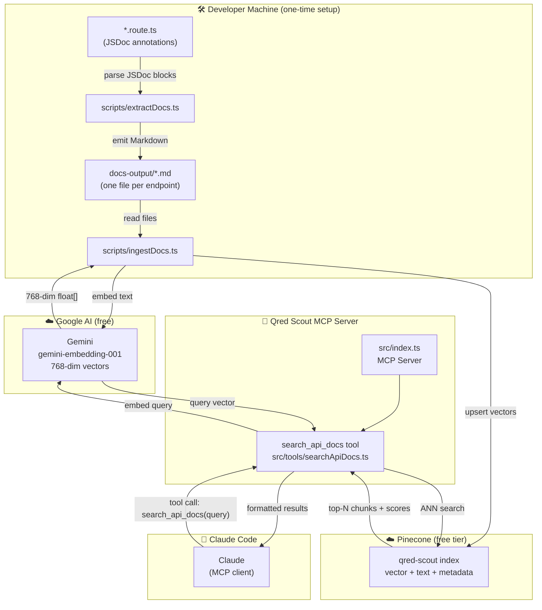

# Qred Scout

> An MCP server that lets AI assistants search Qred's API documentation using natural language — powered by Gemini embeddings, Pinecone vector search, and RAG.

Like a scout who knows the terrain, Qred Scout guides you through the API: what endpoints exist, why they exist, what rules they enforce, and what they return.

---

## Contents

- [Overview](#overview)
- [System Diagram](#system-diagram)
- [Query Flow](#query-flow)
- [Architecture](#architecture)
- [How RAG Works Here](#how-rag-works-here)
- [Vector Storage](#vector-storage)
- [Project Structure](#project-structure)
- [The MCP Tool](#the-mcp-tool)
- [Setup](#setup)
- [Environment Variables](#environment-variables)
- [Roadmap](#roadmap)

---

## Overview

The Qred backend routes contain rich JSDoc blocks that document not just parameters and return types, but **business context** (`@businessContext`) and **business rules** (`@businessRule`) — the _why_ behind each endpoint, not just the _what_.

Qred Scout extracts those JSDocs, converts them into Markdown documents, embeds them via Gemini, stores the vectors in Pinecone, and exposes a single MCP tool (`search_api_docs`) that Claude Code (or any MCP client) can call to retrieve relevant documentation with semantic search.

---

## System Diagram



```
 DEVELOPER MACHINE (one-time setup)
 ┌─────────────────────────────────────────────────────────┐
 │                                                         │
 │  *.route.ts  ──►  extractDocs.ts  ──►  docs-output/    │
 │  (JSDocs)         (parser)             (Markdown files) │
 │                                              │          │
 │                                    ingestDocs.ts        │
 └──────────────────────────────────────────────┼─────────┘
                                                │
                              ┌─────────────────▼──────────────────┐
                              │         GOOGLE AI  (free)          │
                              │   gemini-embedding-001             │
                              │   text  ──►  768-dim float[]       │
                              └─────────────────┬──────────────────┘
                                                │ upsert vectors
                              ┌─────────────────▼──────────────────┐
                              │         PINECONE  (free tier)      │
                              │   qred-scout index                 │
                              │   [ vector | text | source ]  x5   │
                              └────────────────────────────────────┘

 AT QUERY TIME
 ┌──────────────┐     tool call      ┌──────────────────────────┐
 │  Claude Code │ ─────────────────► │   Qred Scout MCP Server  │
 │  (MCP client)│                    │                          │
 │              │                    │  1. embed query (Gemini) │
 │              │                    │  2. ANN search (Pinecone)│
 │              │                    │  3. format top-N chunks  │
 │              │ ◄───────────────── │                          │
 │              │   ranked results   └──────────────────────────┘
 └──────────────┘
```

---

## Query Flow

How a question travels through the system end to end:

```
  User asks Claude:
  "Which endpoints should a finance team use to
   reconcile monthly card spending?"
          │
          ▼
  Claude Code decides to call the MCP tool
  ┌─────────────────────────────────────────┐
  │  search_api_docs(                       │
  │    query: "finance team reconcile       │
  │            monthly card spending",      │
  │    maxResults: 5                        │
  │  )                                      │
  └────────────────────┬────────────────────┘
                       │
                       ▼
  searchApiDocs.ts embeds the query
  ┌─────────────────────────────────────────┐
  │  Gemini gemini-embedding-001            │
  │  "finance team reconcile..." ──► [768 floats]  │
  └────────────────────┬────────────────────┘
                       │
                       ▼
  Pinecone ANN search — finds nearest vectors
  ┌─────────────────────────────────────────┐
  │  score: 0.91  ──  get-transactions.md   │
  │  score: 0.87  ──  get-invoice.md        │
  │  score: 0.81  ──  get-dashboard.md      │
  └────────────────────┬────────────────────┘
                       │
                       ▼
  MCP server returns formatted chunks
  ┌─────────────────────────────────────────┐
  │  ## Result 1 (score: 0.91)              │
  │  Source: get-transactions.md            │
  │  GET /transactions ...business context  │
  │  ...business rules about pagination...  │
  │                                         │
  │  ## Result 2 (score: 0.87)              │
  │  Source: get-invoice.md                 │
  │  GET /invoice ...status field drives UI │
  │  ...amount in minor units (öre/cents).. │
  └────────────────────┬────────────────────┘
                       │
                       ▼
  Claude synthesises a response using the chunks
  as grounded context — answering with actual
  business rules, not hallucinated API behaviour
```

---

## Architecture

```
Route files (*.route.ts)
        │
        ▼
  [1] scripts/extractDocs.ts
      Parses JSDoc blocks
      Emits one Markdown file per endpoint → docs-output/
        │
        ▼
  [2] scripts/ingestDocs.ts
      Reads Markdown files
      Embeds each via Gemini gemini-embedding-001 (free)
      Upserts vectors + text into Pinecone (free tier)
        │
        ▼
  [3] Pinecone index (qred-scout)
      Stores 768-dimension float vectors
        │
        ▼
  [4] Qred Scout MCP server (this app)
      Exposes: search_api_docs(query, maxResults)
      Embeds query via Gemini → queries Pinecone
      Returns: ranked text chunks + source + scores
```

---

## How RAG Works Here

**RAG (Retrieval-Augmented Generation)** means the AI retrieves relevant documents first, then uses them to answer — rather than relying solely on what it was trained on.

The pipeline has two phases:

**Ingestion (offline, run once / on doc change)**
1. `extractDocs.ts` parses all `*.route.ts` files — each endpoint becomes a Markdown document
2. `ingestDocs.ts` reads each Markdown file, sends it to Gemini `gemini-embedding-001` which returns a 768-dimension float vector
3. Each vector + raw text is upserted into the Pinecone index

**Query (real-time, every tool call)**
1. The MCP tool receives a natural language query (e.g. _"how does pagination work in the transactions endpoint?"_)
2. The query is embedded into the same vector space via Gemini
3. Pinecone ANN (approximate nearest neighbour) search finds the most semantically similar chunks
4. The top-N chunks (raw text + source + relevance score) are returned to the caller

---

## Vector Storage

This project uses **Pinecone** (free serverless tier) as the vector store — no AWS required.

Each stored record contains:
- The **embedding vector** (768 floats, Gemini gemini-embedding-001)
- The **original text** (the full Markdown document for that endpoint)
- **Metadata** — source filename

**Cost: $0** — Pinecone's free tier supports 1 index and 2GB storage, which is more than enough for this project.

---

## Project Structure

```
apps/qred-scout/
├── src/
│   ├── index.ts                  MCP server entry point
│   └── tools/
│       └── searchApiDocs.ts      Embeds query via Gemini → searches Pinecone
├── scripts/
│   ├── extractDocs.ts            Parses route JSDocs → Markdown files
│   └── ingestDocs.ts             Embeds Markdown files → upserts into Pinecone
├── docs-output/                  Generated Markdown files (gitignored)
├── .env.example                  Required environment variables
├── package.json                  @qred/qred-scout workspace
├── tsconfig.json
└── README.md
```

---

## The MCP Tool

### `search_api_docs`

Search Qred API documentation using natural language.

**Input**

| Parameter | Type | Default | Description |
|---|---|---|---|
| `query` | `string` | required | Natural language question about the API |
| `maxResults` | `number` | `5` | Number of results to return (1–10) |

**Output**

Plain text with ranked results, each containing:
- Relevance score
- S3 source URI (which route file the chunk came from)
- The raw Markdown chunk (endpoint description, business context, rules, params, responses)

**Example query**

```
search_api_docs("what security rules apply to card activation?")
```

Returns the relevant chunks from `POST /cards/activate` — including the rule that `cardId` goes in the body (not the URL) to avoid appearing in access logs, and that `companyId` always comes from the JWT.

---

## Setup

### 1. Install dependencies

```bash
yarn install
```

### 2. Get your API keys

**Google AI (free)**
- Go to [aistudio.google.com](https://aistudio.google.com) → Get API key
- Copy it into `.env` as `GOOGLE_API_KEY`

**Pinecone (free)**
- Go to [pinecone.io](https://pinecone.io) → sign up → create a Serverless index:
  - Name: `qred-scout`
  - Dimensions: `768`
  - Metric: `cosine`
  - Cloud/Region: AWS `us-east-1` (or closest free region)
- Copy your API key into `.env` as `PINECONE_API_KEY`
- Set `PINECONE_INDEX_NAME=qred-scout`

### 3. Extract and ingest docs

```bash
# Extract JSDocs → Markdown, then embed → upsert into Pinecone
yarn workspace @qred/qred-scout sync-docs

# Or run separately
yarn workspace @qred/qred-scout extract-docs
yarn workspace @qred/qred-scout ingest-docs
```

### 4. Run the MCP server

```bash
# Development
yarn workspace @qred/qred-scout dev

# Production
yarn workspace @qred/qred-scout build
yarn workspace @qred/qred-scout start
```

### 5. Register with Claude Code

Add to `.claude/settings.json` in the repo root:

```json
{
  "mcpServers": {
    "qred-scout": {
      "command": "node",
      "args": ["apps/qred-scout/dist/index.js"]
    }
  }
}
```

---

## Environment Variables

| Variable | Required | Description |
|---|---|---|
| `GOOGLE_API_KEY` | Yes | Google AI Studio API key — used for Gemini embeddings |
| `PINECONE_API_KEY` | Yes | Pinecone API key |
| `PINECONE_INDEX_NAME` | Yes | Name of the Pinecone index (e.g. `qred-scout`) |

Copy `.env.example` to `.env` and fill in the values.

---

## Roadmap

- [x] `scripts/extractDocs.ts` — JSDoc extractor (parses routes → Markdown)
- [x] `scripts/ingestDocs.ts` — embeds Markdown and upserts into Pinecone
- [x] `src/tools/searchApiDocs.ts` — query-time Gemini + Pinecone search
- [ ] `search_and_explain` tool variant that uses Gemini to synthesise an answer from retrieved chunks
- [ ] Claude Code `.claude/settings.json` registration
- [ ] Re-ingest step in CI when route files change
